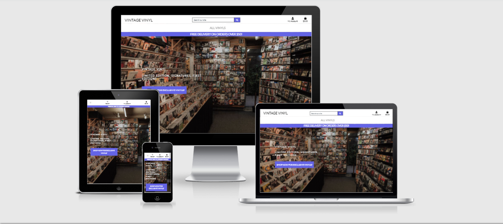
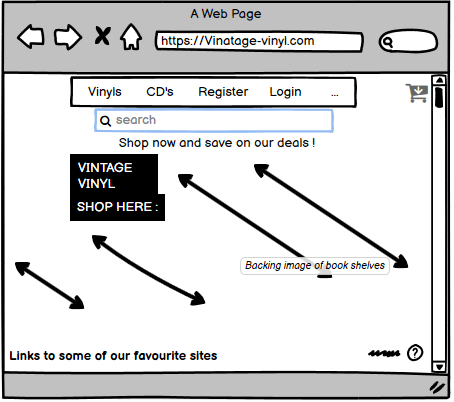
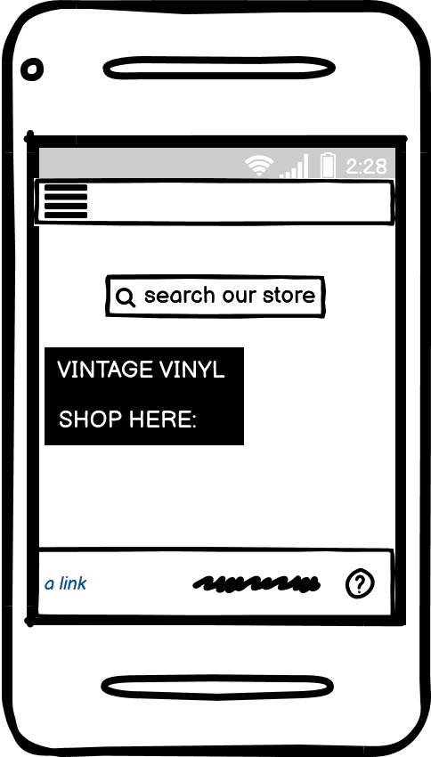
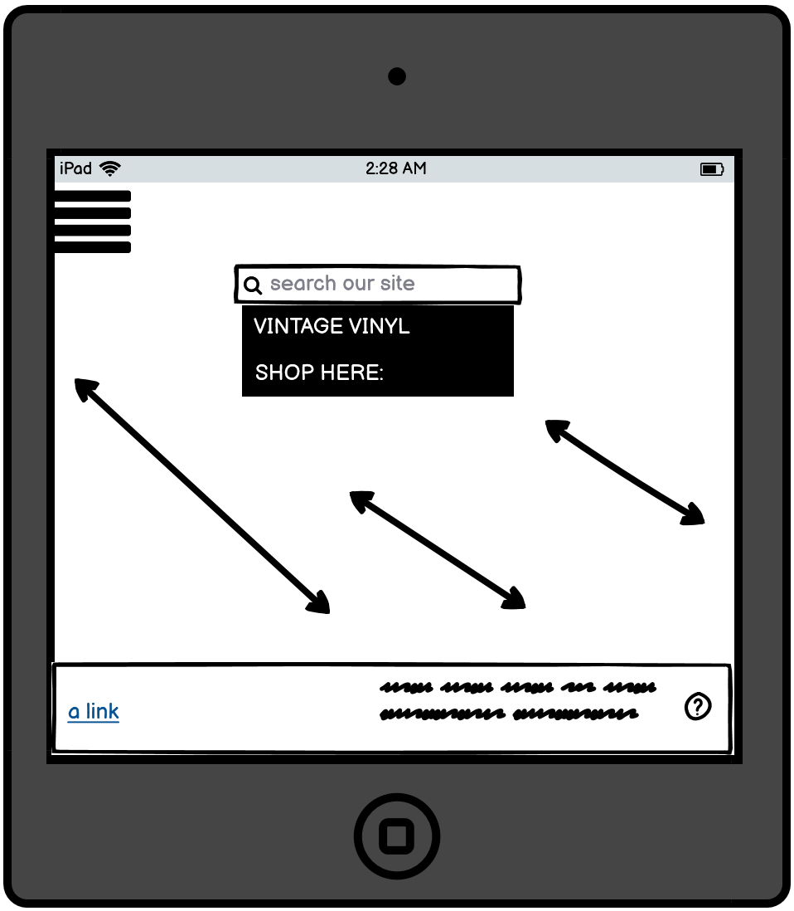

# Welcome

This is the Readme for Vintage Vinyl website! I hope to provide all the necessary information and and answer any questions you may have. I decided to take the approach of making the website first on normal broswer format as in a laptop or computer, then styled and added what was needed for tablet and mobile devices. It is responsive on all devices, view the website here : https://vintage-vinyl-app.herokuapp.com/

This site was built using [GitHub Pages](https://pages.github.com/)

# User Experience (UX)

## User Stories

### 

All users of this site will be looking for similar things bar the admin which can be seen after  the normal users are as follows :

- Navigate easy through all devices and have all areas of website responsive.

 - To be able to view/preview the site before creating an account.

 - Have clear Registration and Log In pages.

 - To be able to view through the vinyl genres avaialble.

  - Have the ability to add their own products and keep a record of them through the superuser.

- To be able to edit and delete prducts via the admin page and with having a normal account.

- for the vinyl information to be clear and concise.

- To be able to securely log out of the site.

- To purchase items successfully 

- To be able to pay with a Credit or Debit card securely.

- To store date securely

- To be able to search items available

- To be able to view and use the asite on a devices and browsers

# Design

## Typograpghy
For my typograpghy I used a Google font lato  with a fallback of sans serif.

## Imagery
I used a image from Google of a Music shop for the backround image of the project, I also used the images for different album coverz all from google images by simply typing in the album.

## Colour Scheme
I used the white background and my shade of purple for nearly all aspects on this site "rgb(100, 100, 230);"

## Wireframes
For the design of my wireframes I used Balsamic, You can find the link to the site here! [ https://balsamiq.com/ ]

I will also include screenshots below.

# Features
- Search bar for people to search products.

- Responsive on all devices 

- Forms and contact section to allow users to give feedback.

- The site is responsive and can be viewed on all viewports.

- Store users data and allow them to create a account.

- Can add a book Review

- Add a Vinyl product.

- Edit a vinyl product through admin.

- Delete a product with admin.

- Register a Account

- View Profile

- Flash messages to let user know if it has gone through or/and been created.

- Site fully responsive on all viewporths and devices.

- Search bar to search for vinyls/productss or reset page if Vinyl not found.

- Stripe security features including input of card payments.

- Edit/delete product information 

- Sign up qhich requires confirmation of email

# Future features
- I would also like to include a questionare about peoples favourite albums and sites.

- Possibly add a game in the future to add even more interactivity.

- Allow the admin to delete book reviews or modiy them more so.

# Technologies used

## languages used

 ### Javascript
 - Used for all script files.

 ### JQuery

 - Used to shorten all Javascript code

 ### CSS
 - Used to style all elemets of the site and for media queries.
 

 ### HTML
 - Used for main structure/text of site

 ### Markdown
 - Used for this Readme.

 ###  Python
 - used for all .py files and most of backend development.

### DJANGO
- Framework which admina and whole site is based off.

## Database

### Postgres
- Used for deployment to heroku.

### db squlite
- Used as a realtional database.

### Database diagram 

#### 
- For my data base I sketched a quick diagram 

	

  - For future I would have a much more laid out Diagram to represent my DB however close to submission I lost my original DB drawing.

 # Testing

## To test my code I did it in the following way
- I ran the code through the different validators for each of my languages.
- I would copy sections of code so as not to do a whole page and fix any problems within the section first.

- Paste the code into the correct tester.

- Once results and errors (if present) are visble, examine and correct the changes needed.

- Repeated the same process for all the languages.

## I browsed through the site on all the different types of view port to ensure it worked well.

- I would browse through all of the site on the mobile and tablet viewports.

- I check all the links to make sure they worked correctly, I looked at the text content to make sure it came out the way intended.

- I would then make sure that all the correct text is visble and not too small, then I would interact with all the interactive elements to make sure they reacted correctly.

- Open google tools and view any errors present.

- Correct the changes if needed.

 - I viewed the site on different browsers to see how it reacted.

- I would open up a different browser be it be it mozilla,internet explorer or google.

- I would interact and click all the links available to make sure they worked.

- Interact with all interactive elements and code to make sure it ran they way its supposed to.

## Security Testing
All pages were tested to make sure that no unauthorised users can access pages they should not have access to. If a user is logged out, they have no access to any pages they should not have access to. All admin only pages can only be accessed by the admin. Redirects are all working as expected, with correct flash messages present.

## Testing user stories

- Navigate easy through all devices and have all areas of website responsive.
- The site is fully responsive regardless of device used, and the navbar is clear and easy to navigate through on both mobile and desktop/laptop devices.

- To be able to view/preview the site before creating an account.
Users will have full access to the vinyls available on site, they may not purchase until they have a account.

- Have clear Registration and Log In pages.
The registration and log in pages are clearly marked within the navbar, they are also linked on the home page, and are set as redirections for certain actions on the site if the user is not logged in.

- To be able to view albums and make purchases.
Once a user has registered an account, they will easily be able to buy vinyls or Albums

- For the review information to be clear and concise.
The Album information is laid out clearly and users are shown very quickly what the site is about.

- To be able to securely log out of the site.
There is a clear Log Out header which appears in the navbar for users who are logged in .

- To store date securely
The admin and user are both able to store their data which is sent to a heorku datebase, the passwords are salted to add more security and stop brute forcing.

- To purchase items successfully 
All items have a successful toast whenever a porduct is either added, edited or deleted from a shopping bag.

- All payments are validate after a user hits submit.

. The card inputs have to be validated card details thanks to stripes features

- To store date securely
 all data is stored carefully within AWS Stripe, Google and Django.

- To be able to search items available
 The main page has a seach bar which all users can use to search for products.

- To be able to view and use the site on different devices and browsers

This site is responsive on all platforms,devices and web browsers.

 # Deployment
To deploy my Project to Github do it following these steps

- Open up your Github and navigate to your repository.

- Under the Repository section click settings.

 - Locate Git hub pages by scrolling down and underneath it click the drop-down menu to select a folder for your publishing source.

- Click save and locate the link under the same section and click into the site.

 ## Heroku

 - This project is deployed using Heroku. I done it in the following way

 - Within GitPod, create the .gitignore and env.py files.

 - In the .gitignore file, set it to ignore the env.py file and pycache/ directory.

- Within the env.py file, set the following environmental variable:

 - os.environ.setdefault(“IP”, “0.0.0.0”)

- os.environ.setdefault(“PORT”, “5000”)

- os.environ.setdefault(“SECRET_KEY”, “YOUR_SECRET_KEY”)

- os.environ.setdefault(“MONGO_URI”, “mongo db link to go here”)

- os.environ.setdefault(“MONGO_DBNAME”, “YOUR_DATABASE_NAME”)

- Make sure that the env.py file has been saved correctly and open the app.py file.

- Import OS, Flask and the env.py file.

- Create a requirements.txt file by typing in the terminal; pip3 freeze –local > requirements.txt.

- For Heroku, you will also need a Procfile. Create this by using the terminal and typing; echo web: python app.py > Procfile.

- Access the Procfile and delete the bottom empty line to avoid any issues in the future.

- Go to the Heroku site, and log in or create a profile. From the dashboard, select “New App”.

- Create a name for your app, select the correct region and click “Create App”.

- Navigate over to the “Deploy” tab and go to the “Deployment method” section. Click on GitHub.

- Search for your repository name, and click “Connect” next to your repository name.

- Next, go to the “Settings” tab, and scroll down to “Config Vars”. Click “Reveal config vars”.

- Enter the Key and Value pairs as per your env.py file; IP : 0.0.0.0 PORT : 5000 SECRET_KEY : YOUR_SECRET_KEY MONGO_URI : “mongo db link to go here” MONGO_DBNAME : “your database name”

- Finally, go back to the “Deploy” tab, and scroll down to “Automatic deploys”. Click on “Enable Automatic Deploys” then “Deploy Branch”. The app will now be built and upon completion, you will receive a message saying “Your app was successfully deployed”.

- You can now click on “Open App” which will launch the deployed app.

## AWS

- Created a new Amazon account and connect to amazon service AWS3 account are cloud based serve where the project media and staicfiles will be stored unto. At first, we locate S3 on amazon service then we create a bucket. While creating the bucket on S3, the note that public access must be all switched off to allow access for users.

- Once we've created the bucket, we now can now click on it's properties and enable the Static Website Hosting option, so it can serve the purpose of hosting our static files, you will need to input an index.html and error.html before saving. Then we go into the created bucket Permissions and click into CORS configuration, this part already have a prefilled default config, All that is needed is just to write the default code and save the config.

- Then we go into the bucket policy to allows access to the contents across all web and inside this we will put in here some code including arn address displayed at the top of the heading. Then we go into amazon IAM to allow identity and access management of our stored files and folder. In the IAM service, we add a new group for our application and then we set the policies to ALL Then it generates a downlaodable zip file containing ID and KEY for us to use for the newly added group. This ID and KEY as to be stored in an environment variable.

- This then allows us to into our terminal window and install some settings Boto3 Django Storages

- The Django Storages is passed into the installed apps in settings and also a custom_storage file is created to store credentials in environment variable. And once everything looks fine we can run python3 manage.py collectstatic. This will collect all the static files in our app including any changes that is made. N.B this command has to be run in the development(local) environment each time a change is been made in the static files/folder and your folder and files should display in your AWS S3 BUCKETS

## Run code locally
- To run my code locally follow these steps: Log in to GitHub and locate the GitHub Repository

- Under the repo name click Clone.

- To clone a copy of the repo using HTTPS, copy the link under "Clone with HTTPS".

- Using your IDE of choice open up your preferred terminal.

- Navigate to your desired file location.

- Copy the link and input it into your terminal to clone my project.

- You are Done!

## Cloning
If you wish to clone or download this repository to your local device you can follow the procedure outlined below.

- Go to the GitHub website and log in.

- Locate the Repository used for this project.

- Under the Repository name locate 'Clone or Download' button in green.

- To clone the repository using HTTPS click the link under "Clone with HTTPS".

- Open your Terminal and go to a directory where you want the cloned directory to be copied in.

- Type Git Clone and paste the URL you copied from the GitHub.
To create your local clone press Enter

## Forking
If you wish to contribute to this website you can Fork it without affecting the main branch by following the procedure outlined below.

- Go to the GitHub website and log in.

- Locate the Repository used for this project.

- On the right-hand side of the Repository name, you'll see the 'Fork' button  It's located next to the 'Star' and 'Watch' buttons.

- This will create a copy in your personal repository.

- Once you're finished making changes you can locate the 'New Pull Request' button just above the file listing in the original repository.

 ### You can get more of this information in more detail here: (https://docs.github.com/en/github/creating-cloning-and-archiving-repositories/cloning-a-repository)

 ## Known Bugs and Problems
 - The biggest and most troublesome challenge I had with this project happened after I had to re-open my workspace due to inactivity. This then allowed the update that Gitpod had on the 7th of December. This caused our requirements.txt file to be courrupted and made the CI template no longer useable. I had to re-install all of django and its dependancies and then I had to recreate a new admin and add all my products again along with making migrations. This was by far the problem that set me back the most as I had to redo this multiple times, if my workspace closed at all it had to be re-done. My workspace had dissapeard from Gitpod a week ago and I had to go through these steps again.

 - I also had to add fav icon error which required a simple fix of just adding <link rel="stylesheet" href=""> to my head element links.

 - I experienced my CSS not been applied to my live site when I deployed from herokyu the sewcond time, to fix this I had to first chekc my AWS Bucket and make sure everything was up to date which it was. I then had to check my heroku logs which informed me that it was my database.url not havebeen exported. This then allowed my CSS to be appplid Once it was successfully exported. 

 - I cannot get the media to be uploaded to my deployed heroku site even after creating a file on the Amazone bucket, I have had the deploying steps done at the start yet these problems were not visble until yesterday when I went to redeploy.
 -
 -

 ## Points to Consider

 - I have been working on this project fopr what feels like forever and have enjoyed not one second of it, the update from Gitpod set me back so much that even now when I am writing this on the day of submission I think I will still not get the project working fully due to having to constantly to re-install and redo much of the project.

## Credit
First I would like to thank my mentor Samantha for all the help and then the Code Institute! I would also like to thank all the tutors you have all been amazing and lastly but not least anyone on Slack who reached out and helped with my many problems.

- I would aslo like to credit ckz8780 Chris and the Code Institute as the whole project is based of the Botique Ado project.

### Credit (links)

adapted and project inspired from mini project "putting it all together"
W3C SCHOOLS
https://www.w3schools.com/default.asp

used for inspiration on many aspects, adapted contact form from there site
JSHINT
https://jshint.com/

Used to correct JS
JIGSAW
https://jigsaw.w3.org/css-validator/

Used to correct CSS.
JQuery
Used for materialize code.
Google fonts
https://fonts.google.com/specimen/Be+Vietnam+Pro

Used for my lato font.

## Media
Google images was used for all my images, from getting the background image to all the Album covers that you see on the site.

- https://www.google.com/search?q=google+images&oq=google+images&aqs=chrome..69i57j0i433i512j0i512l7j0i10i512.3178j0j7&sourceid=chrome&ie=UTF-8

FONT AWESOME
https://fontawesome.com/v5.15/icons?d=gallery&p=2
used for Icons for socials in footer.

WIKIPEDIA
https://en.wikipedia.org/wiki/Main_Page

- Used to get the descriptions for the Albums.

HTML validator
https://validator.w3.org/nu/#textarea

- Used to correct code

W3C CSS validator
https://jigsaw.w3.org/css-validator/validator

- Used to correct code

Am I responsive
http://ami.responsivedesign.is/#

- Used for mock up

Python Checker
https://extendsclass.com/python-tester.html

- used to correct python

Acknowledgements 
-  Firt my mentor Samantha Megan, always givesa great advise and insights!

- The Code Institute!

- The community on slack always a great help!

- The lovely Tutors who time and time helped me a great deal during this project!